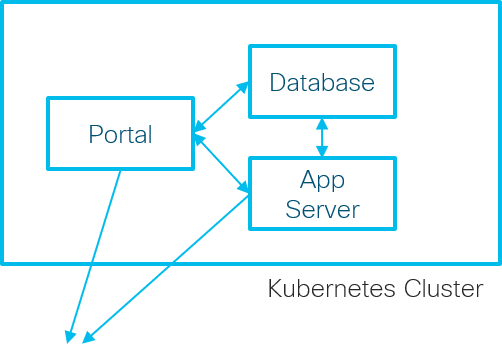
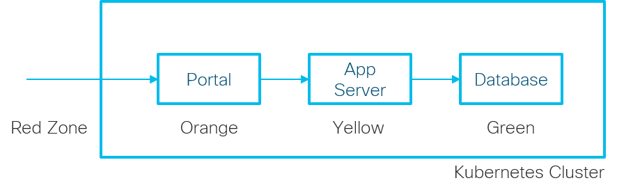

Objective of this scenario is to cofigure Kubernetes network policies to secure pod communication.

Kubernetes network policies are application level constructs that control pod communication policies. By default, Kubernetes does not have any network policies. In other words, pods are `non-isolated`. All pods can communicate with each other on exposed ports and with external systems.

Network policies can to restrict communication between pods, and 'isolate` the pods. Such isolation policies help contain the damage from compromised workloads.

One popular isolation mechanism is `Network Segmentation` or `Zoning`. Network entities are categorized based on the risk level.

- Red Zone - Entities outside the cluster/trust-boundary
- Organge Zone - Workloads exposed to external systems
- Yellow Zone - Internal Application workloads
- Green Zone - Databases and storage systems

